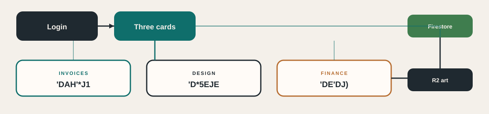
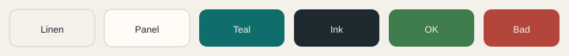

<div align="center">


# Balance Bites Ops

**Private staff hub** for invoices, label design, and finance & inventory.


<br />

[](https://balance-bites-ops.vercel.app)
[](https://balance-bites-ops.vercel.app)
[](https://github.com/Jovo-Jovi/balance-bites-ops)

[](https://nextjs.org)
[](https://firebase.google.com)
[](https://www.cloudflare.com/developer-platform/r2/)
[](#apps)
[](https://balance-bites-ops.vercel.app)

One URL. Three cards after login. **No KPIs on the hub.** Live data is Firebase + Cloudflare R2 — GitHub is code only.

</div>

---

## Apps

<table>
<tr>
<td width="33%" valign="top">

###  الفواتير · Invoices

**Live on `main`**

Customers, invoice editor, catalog pick, prep queue, history, reports, and **Look** (shared print colors).

- New invoice · save · print
- Paid / pending collection
- Price list print
- Prep drafts become `#INV-` after finance approve

</td>
<td width="33%" valign="top">

###  التصميم · Design

**Live on `main`**

Native library, studio, and print house. Not an HTML wrap.

- Family dies · composite · wrap / taper / lid
- R2 `label_assets/` (not Firebase Storage)
- Cut / exact / bleed PNG · 300 DPI · 1.5 mm bleed
- Flavor packs are **code**, not a Firestore dump

</td>
<td width="33%" valign="top">

###  المالية · Finance

**Live on `main`**

Eight tools: overview, invoices, stock, prep, purchases, recipes, returns, ops.

- On-hand = purchases − BOM usage
- Prep board, production, P&amp;L, investors
- Named backups on R2
- **تحميل نسخة محلية** zip (JSON + label art)

</td>
</tr>
</table>

---

## What it does

| Color | Area | Highlights |
|---|---|---|
|  | Billing | Editor, customers, catalog pick, Look print theme, reports, collection flags |
|  | Labels | Library thumbs, Studio layers, print house SVG/PNG, template JSON |
|  | Stock & P&amp;L | Ledger, recipes, prep → production, returns, opex, investor diary |
|  | Cloud | Firestore `bb_*` keys · R2 art · staff zip backup · locked rules |



---

## Brand

Ink diamond on linen. Teal only on actions. One mark for all three apps.



| Token | Hex | Use |
|---|---|---|
| Linen | `#f4f0ea` | Page |
| Panel | `#fffbf7` | Cards |
| Teal | `#0f6e6b` | Actions |
| Ink | `#1f2930` | Wordmark / diamond |
| OK | `#3f7d4e` | Paid / profit |
| Warn | `#b76e32` | Pending |
| Bad | `#b4453a` | Loss |

Type: Playfair Display · Syne · DM Sans · Tajawal. Map: [docs/BRAND-UI.md](docs/BRAND-UI.md).

---

## Data (not this repo)

Live tenant: **balance-bites**.

| Store | What |
|---|---|
| **Firestore** | `tenants/balance-bites/keys/{bb_*}` — invoices, catalog, recipes, templates, payments… |
| **Cloudflare R2** | `label_assets/` art · `bb_backups/` named snapshots |
| **Hub download** | Staff zip of existing keys **and** label assets (`bb-saved-data-YYYY-MM-DD.zip`) |

Stock on-hand is **not** a typed count:

**purchases − recipe usage from invoices** (production if there are no invoices)

Never seed empty catalogs or gold themes when a cloud key is missing. Writer map: [docs/DATA.md](docs/DATA.md).

---

## Run locally

```bash
cd hub
npm install
npm run dev
```

Vercel **Root Directory** is `hub`. Setup: [SETUP.md](SETUP.md).

```
balance-bites-ops/
  hub/              Next.js App Router
  docs/             Maps, parity, journal, brand SVGs
  firestore.rules   Staff-only (Spark — no Firebase Storage)
```

---

## Docs

| Doc | Use |
|---|---|
| [PARITY.md](docs/PARITY.md) | Tick-list vs live HTML |
| [JOURNAL.md](docs/JOURNAL.md) | What already shipped |
| [INVOICES.md](docs/INVOICES.md) | Invoice workspace |
| [DESIGN.md](docs/DESIGN.md) · [DESIGN-STUDIO.md](docs/DESIGN-STUDIO.md) | Design + studio waves |
| [FINANCE.md](docs/FINANCE.md) · [FINANCE-WAVES.md](docs/FINANCE-WAVES.md) | Finance eight tools |
| [DATA.md](docs/DATA.md) | Who writes which `bb_*` key |
| [MODULES.md](docs/MODULES.md) | Live HTML source map |
| [CLOUD-PLAN.md](docs/CLOUD-PLAN.md) | Cloud cutover |

**Invoices**, **Design**, and **Finance** native workspaces are on `main`.

---

## License

Private. All rights reserved — **Balance Bites**.
